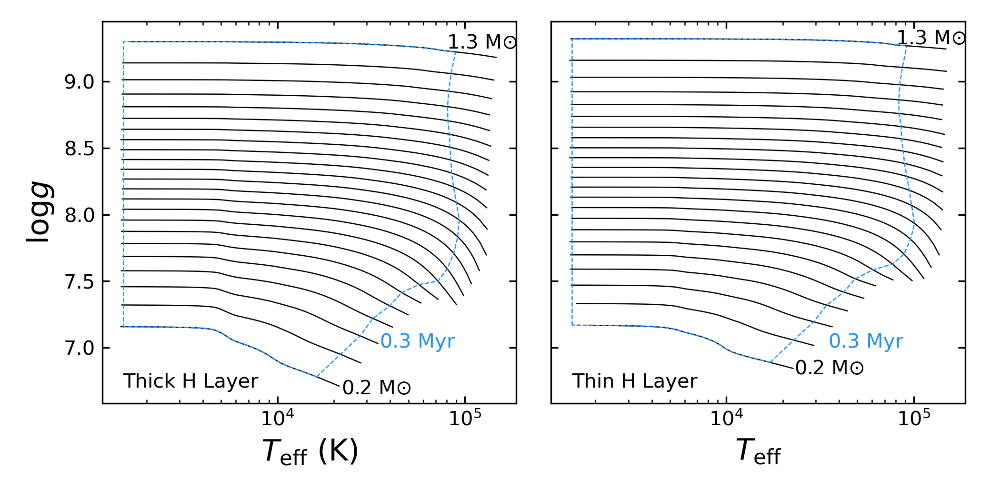

.. _Models included:

Models included
===============

In order to estimate an age for a white dwarf a chain of models have to be used. Here are the models included in :math:`\texttt{wdwarfdate}`.

+-----------------+------------------+----------------------------------------------------------------------------------------------------------------------------------------------------------------------------------------------------------------------------------------------------------+
| :math:`\texttt{wdwarfdate}`                                                                                                                                                                                                                                                                   |
+=================+==================+==========================================================================================================================================================================================================================================================+
| Models Included | Cooling Models   | Cooling tracks from the Montreal White Dwarf Group available `online <http://www.astro.umontreal.ca/~bergeron/CoolingModels/>`_ (`Berdard et al. 2020 <https://ui.adsabs.harvard.edu/abs/2020ApJ...901...93B/abstract>`_):                               |
|                 |                  |  - Thick H layer (DA)                                                                                                                                                                                                                                    |
|                 |                  |  - Thin H layer (non-DA)                                                                                                                                                                                                                                 |
|                 +------------------+----------------------------------------------------------------------------------------------------------------------------------------------------------------------------------------------------------------------------------------------------------+
|                 | IFMR             | - `Marigo et al. (2020) <https://ui.adsabs.harvard.edu/abs/2020NatAs...4.1102M/abstract>`_                                                                                                                                                               |
|                 |                  | - `Cummings et al. (2018) <https://iopscience.iop.org/article/10.3847/1538-4357/aadfd6>`_ MIST and PARSEC based.                                                                                                                                         |
|                 |                  | - `Salaris et al. (2009) <https://ui.adsabs.harvard.edu/abs/2009ApJ...692.1013S/abstract>`_                                                                                                                                                              |
|                 |                  | - `Williams et al. (2009) <https://iopscience.iop.org/article/10.1088/0004-637X/693/1/355>`_                                                                                                                                                             |
|                 +------------------+----------------------------------------------------------------------------------------------------------------------------------------------------------------------------------------------------------------------------------------------------------+
|                 | Stellar evolution| MESA Isochrones `available online <http://waps.cfa.harvard.edu/MIST/>`_ (`Choi et al. 2016 <https://iopscience.iop.org/article/10.3847/0004-637X/823/2/102>`_ and `Dotter 2016 <https://iopscience.iop.org/article/10.3847/0067-0049/222/1/8>`_):        |
|                 | models           |  - :math:`{\rm Fe/H} = -4.00, -1.00, 0.00, 0.50`                                                                                                                                                                                                         |
|                 |                  |  - :math:`{\rm v/vcrit} = 0.0, 0.4`                                                                                                                                                                                                                      |
|                 |                  |  - :math:`\alpha/{\rm Fe} = 0`                                                                                                                                                                                                                           |
+-----------------+------------------+----------------------------------------------------------------------------------------------------------------------------------------------------------------------------------------------------------------------------------------------------------+

The Figure below shows the cooling tracks used by :math:`\texttt{wdwarfdate}` which indicate the limits in effective temperature and surface gravity in more detail for the models of thich and thin H layers (Kiman et al. in prep).

Constraints
===========

We summarize here the most important constraints when using :math:`\texttt{wdwarfdate}`. For a complete discussion see Kiman et al. in prep.

- Combining the limitation of the cooling tracks with the restrictions of the IFMR, the values for which :math:`\texttt{wdwarfdate}` can estimate a total age are :math:`1,500  \leqslant T_{\rm eff}  \lesssim 90,000\,K` and :math:`7.9  \lesssim \log g  \lesssim 9.3`.
- Given that the cooling tracks assume single star evolution and C/O core for the white dwarfs, the best range of final masses to use :math:`\texttt{wdwarfdate}` is :math:`0.45-1.1\,{\rm M}_{\odot}`, because outside this range objects are not likely to have evolved as a single star.